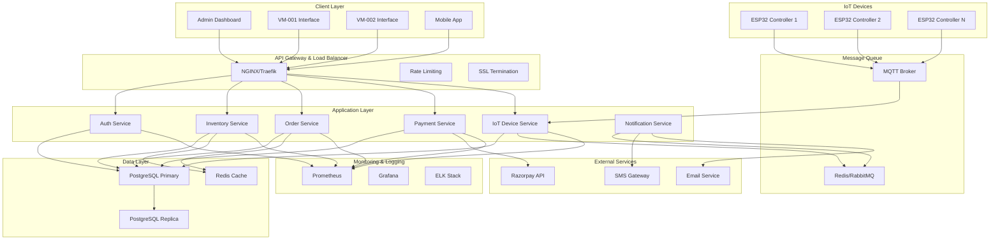
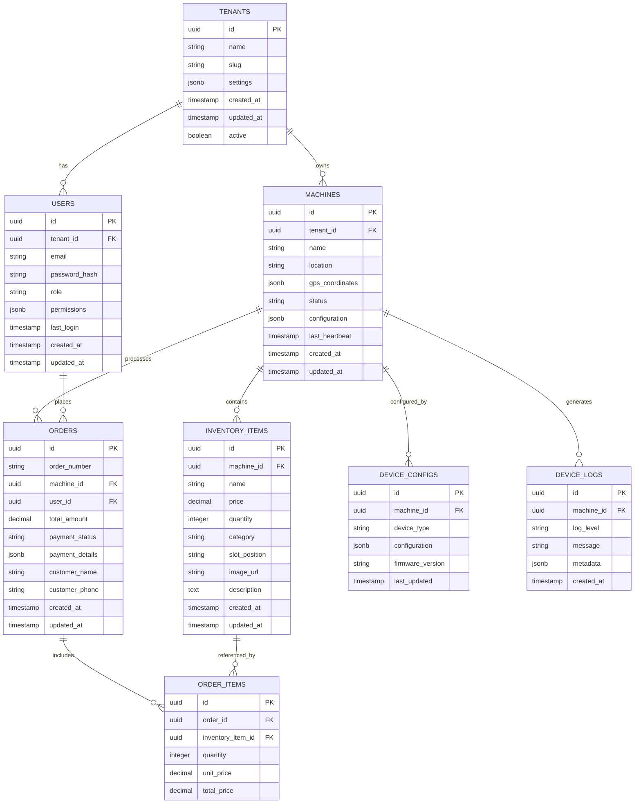
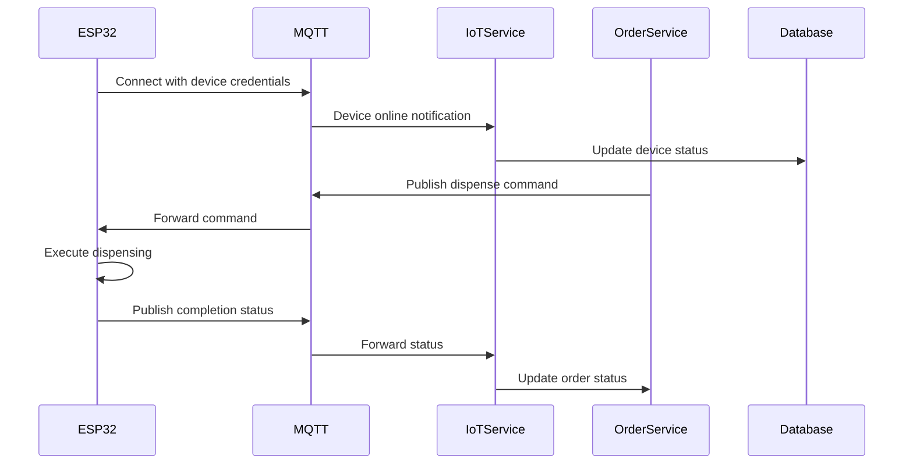
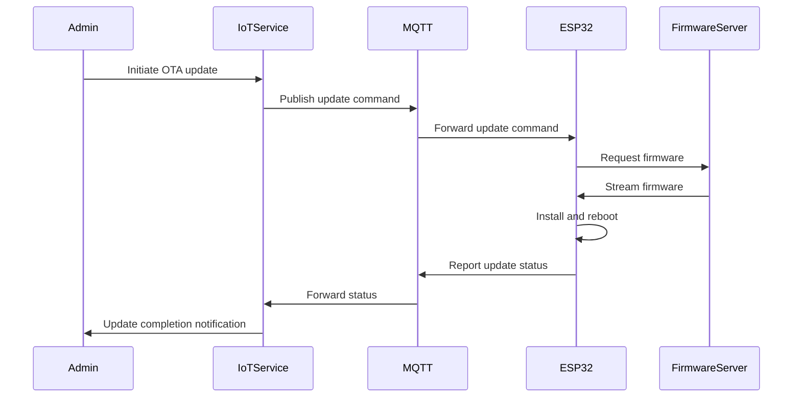
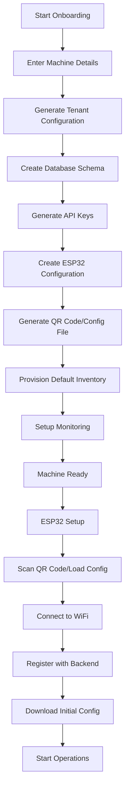

# Production Readiness Design Document

## Overview

This design document outlines the architecture and implementation strategy for transforming the existing IoT vending machine system into a production-ready, enterprise-grade solution. The design addresses security hardening, database migration, infrastructure improvements, IoT device management, and operational excellence while maintaining backward compatibility and system functionality.

The solution will implement a microservices-oriented architecture with proper separation of concerns, secure communication protocols, and robust monitoring capabilities. Special emphasis is placed on ESP32 integration, machine provisioning workflows, and multi-tenant data isolation.

## Architecture

### High-Level System Architecture



### Database Architecture



## Components and Interfaces

### 1. Authentication & Authorization Service

**Purpose:** Centralized authentication and role-based access control

**Key Features:**
- JWT token-based authentication
- Role-based permissions (Admin, Operator, Viewer)
- Multi-tenant user isolation
- API key management for ESP32 devices
- Session management and token refresh

**API Endpoints:**
```typescript
interface AuthService {
  POST /auth/login
  POST /auth/logout
  POST /auth/refresh
  GET /auth/profile
  POST /auth/register-machine
  POST /auth/device-token
}
```

### 2. Machine Management Service

**Purpose:** Handle machine onboarding, configuration, and monitoring

**Key Features:**
- Guided machine onboarding workflow
- Automatic tenant provisioning
- ESP32 device registration
- Configuration template management
- Health monitoring and alerts

**API Endpoints:**
```typescript
interface MachineService {
  POST /machines/onboard
  GET /machines/{id}/config
  PUT /machines/{id}/config
  GET /machines/{id}/status
  POST /machines/{id}/provision-device
  DELETE /machines/{id}/decommission
}
```

### 3. IoT Device Management Service

**Purpose:** Manage ESP32 devices and handle IoT communications

**Key Features:**
- MQTT broker integration
- Device authentication and authorization
- OTA firmware updates
- Real-time command dispatch
- Device health monitoring
- Sensor data collection

**MQTT Topics:**
```
devices/{machine_id}/commands/dispense
devices/{machine_id}/status/inventory
devices/{machine_id}/status/health
devices/{machine_id}/logs
devices/{machine_id}/config/update
```

### 4. Enhanced Order Service

**Purpose:** Process orders with improved reliability and error handling

**Key Features:**
- Distributed transaction support
- Inventory reservation system
- Payment processing integration
- Order state management
- Automatic retry mechanisms
- Dead letter queue for failed orders

### 5. Inventory Management Service

**Purpose:** Real-time inventory tracking with ESP32 integration

**Key Features:**
- Real-time stock updates from ESP32
- Low stock alerts
- Bulk inventory operations
- Image management with CDN
- Category and slot management
- Inventory forecasting

## Data Models

### Enhanced Tenant Model
```typescript
interface Tenant {
  id: string;
  name: string;
  slug: string;
  settings: {
    paymentGateway: PaymentGatewayConfig;
    notifications: NotificationConfig;
    branding: BrandingConfig;
  };
  subscription: {
    plan: string;
    status: string;
    expiresAt: Date;
  };
  createdAt: Date;
  updatedAt: Date;
  active: boolean;
}
```

### Machine Configuration Model
```typescript
interface MachineConfig {
  id: string;
  machineId: string;
  hardware: {
    esp32Config: ESP32Config;
    dispensingMechanism: DispensingConfig;
    sensors: SensorConfig[];
    paymentHardware: PaymentHardwareConfig;
  };
  software: {
    firmwareVersion: string;
    uiTheme: string;
    features: string[];
  };
  network: {
    wifiConfig: WiFiConfig;
    mqttConfig: MQTTConfig;
  };
  lastUpdated: Date;
}
```

### ESP32 Device Model
```typescript
interface ESP32Device {
  id: string;
  machineId: string;
  deviceId: string;
  status: 'online' | 'offline' | 'maintenance';
  firmwareVersion: string;
  lastHeartbeat: Date;
  configuration: {
    pins: PinConfiguration;
    sensors: SensorConfiguration;
    actuators: ActuatorConfiguration;
  };
  diagnostics: {
    uptime: number;
    memoryUsage: number;
    wifiSignalStrength: number;
    temperature: number;
  };
}
```

## Error Handling

### Standardized Error Response Format
```typescript
interface APIError {
  error: {
    code: string;
    message: string;
    details?: any;
    timestamp: string;
    requestId: string;
  };
  success: false;
}
```

### Error Categories and Handling Strategy

1. **Validation Errors (400)**
   - Input validation failures
   - Schema validation errors
   - Business rule violations

2. **Authentication Errors (401)**
   - Invalid credentials
   - Expired tokens
   - Missing authentication

3. **Authorization Errors (403)**
   - Insufficient permissions
   - Tenant access violations
   - Resource access denied

4. **Resource Errors (404)**
   - Machine not found
   - Order not found
   - Inventory item not found

5. **Conflict Errors (409)**
   - Insufficient inventory
   - Duplicate machine registration
   - Concurrent modification conflicts

6. **Integration Errors (502/503)**
   - Payment gateway failures
   - ESP32 communication errors
   - External service unavailability

### Circuit Breaker Pattern
Implement circuit breakers for external service calls:
- Razorpay payment processing
- SMS/Email notifications
- ESP32 device communications

## Testing Strategy

### Unit Testing
- Service layer business logic
- Utility functions and helpers
- Data validation and transformation
- Error handling scenarios

### Integration Testing
- Database operations
- External API integrations
- MQTT message handling
- Authentication flows

### End-to-End Testing
- Complete order workflows
- Machine onboarding process
- ESP32 device provisioning
- Payment processing flows

### Load Testing
- API endpoint performance
- Database query optimization
- WebSocket connection limits
- MQTT message throughput

### Security Testing
- Authentication bypass attempts
- SQL injection prevention
- XSS protection
- API rate limiting
- Tenant data isolation

## Security Implementation

### Authentication & Authorization
```typescript
// JWT Token Structure
interface JWTPayload {
  sub: string; // user ID
  tenantId: string;
  role: string;
  permissions: string[];
  iat: number;
  exp: number;
}

// API Key for ESP32 devices
interface DeviceAPIKey {
  keyId: string;
  machineId: string;
  tenantId: string;
  permissions: string[];
  expiresAt: Date;
}
```

### Data Encryption
- Database encryption at rest using PostgreSQL TDE
- API communication via TLS 1.3
- Sensitive data encryption using AES-256
- Key rotation policies for API keys and secrets

### Input Validation
```typescript
// Example validation schema using Zod
const CreateOrderSchema = z.object({
  items: z.array(z.object({
    id: z.string().uuid(),
    quantity: z.number().min(1).max(10)
  })).min(1),
  customerName: z.string().optional(),
  customerPhone: z.string().regex(/^\+?[1-9]\d{1,14}$/).optional()
});
```

## Infrastructure Design

### Containerization Strategy
```dockerfile
# Multi-stage Docker build
FROM node:18-alpine AS builder
WORKDIR /app
COPY package*.json ./
RUN npm ci --only=production

FROM node:18-alpine AS runtime
RUN addgroup -g 1001 -S nodejs
RUN adduser -S nextjs -u 1001
WORKDIR /app
COPY --from=builder --chown=nextjs:nodejs /app/node_modules ./node_modules
COPY --chown=nextjs:nodejs . .
USER nextjs
EXPOSE 3000
CMD ["node", "index.js"]
```

### Kubernetes Deployment
```yaml
apiVersion: apps/v1
kind: Deployment
metadata:
  name: vending-machine-api
spec:
  replicas: 3
  selector:
    matchLabels:
      app: vending-machine-api
  template:
    metadata:
      labels:
        app: vending-machine-api
    spec:
      containers:
      - name: api
        image: vending-machine-api:latest
        ports:
        - containerPort: 3000
        env:
        - name: DATABASE_URL
          valueFrom:
            secretKeyRef:
              name: db-secret
              key: url
        resources:
          requests:
            memory: "256Mi"
            cpu: "250m"
          limits:
            memory: "512Mi"
            cpu: "500m"
```

### Environment Configuration
```typescript
interface EnvironmentConfig {
  NODE_ENV: 'development' | 'staging' | 'production';
  PORT: number;
  DATABASE_URL: string;
  REDIS_URL: string;
  MQTT_BROKER_URL: string;
  JWT_SECRET: string;
  RAZORPAY_KEY_ID: string;
  RAZORPAY_KEY_SECRET: string;
  LOG_LEVEL: 'debug' | 'info' | 'warn' | 'error';
  MONITORING_ENABLED: boolean;
}
```

## Monitoring and Observability

### Logging Strategy
```typescript
// Structured logging with Winston
const logger = winston.createLogger({
  level: process.env.LOG_LEVEL || 'info',
  format: winston.format.combine(
    winston.format.timestamp(),
    winston.format.errors({ stack: true }),
    winston.format.json()
  ),
  defaultMeta: { service: 'vending-machine-api' },
  transports: [
    new winston.transports.File({ filename: 'error.log', level: 'error' }),
    new winston.transports.File({ filename: 'combined.log' }),
    new winston.transports.Console({
      format: winston.format.simple()
    })
  ]
});
```

### Metrics Collection
- Application metrics (request count, response time, error rate)
- Business metrics (orders per hour, revenue, inventory levels)
- Infrastructure metrics (CPU, memory, disk usage)
- ESP32 device metrics (connectivity, sensor readings, uptime)

### Health Checks
```typescript
interface HealthCheck {
  status: 'healthy' | 'degraded' | 'unhealthy';
  timestamp: string;
  services: {
    database: ServiceHealth;
    redis: ServiceHealth;
    mqtt: ServiceHealth;
    paymentGateway: ServiceHealth;
  };
  devices: {
    online: number;
    offline: number;
    total: number;
  };
}
```

### Alerting Rules
- Database connection failures
- High error rates (>5% in 5 minutes)
- ESP32 device offline for >10 minutes
- Payment processing failures
- Low inventory alerts
- System resource exhaustion

## ESP32 Integration Architecture

### Device Communication Flow


### OTA Update Process


## Machine Onboarding Workflow

### Onboarding Process Flow


### Configuration Generation
```typescript
interface MachineOnboardingConfig {
  machine: {
    id: string;
    name: string;
    location: string;
    gpsCoordinates?: { lat: number; lng: number };
  };
  tenant: {
    id: string;
    apiKey: string;
    mqttCredentials: MQTTCredentials;
  };
  esp32: {
    deviceId: string;
    wifiConfig: WiFiConfig;
    mqttConfig: MQTTConfig;
    pinConfiguration: PinConfiguration;
  };
  inventory: InventoryTemplate[];
}
```

This comprehensive design addresses all the requirements while maintaining the existing functionality and providing a clear path to production readiness. The architecture is scalable, secure, and maintainable with proper separation of concerns and modern best practices.